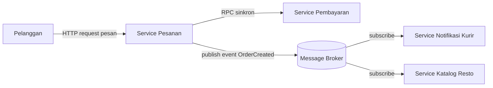

# Tugas 2 (Pekan 2) — Perancangan Arsitektur untuk FoodGo

**Materi terkait:** Architectural style (Layered, SOA, Peer-to-Peer, Publish-Subscribe).

## Studi Kasus

Melanjutkan Tugas 1: FoodGo butuh sistem yang **decoupled** agar tim kurir dan tim resto tidak saling mengganggu ketika salah satu modul diperbarui/deploy ulang. Saat ini semua modul (pesanan, pembayaran, notifikasi kurir, katalog resto) berjalan sebagai satu aplikasi monolitik — sekali deploy, semua modul ikut restart dan berisiko downtime total.

## Tugas Kelompok

1. Pilih **satu** gaya arsitektur utama: **Service-Oriented Architecture (SOA)** atau **Publish-Subscribe**. Boleh dikombinasikan (mis. SOA untuk service inti + Pub-Sub untuk notifikasi), tapi harus dijustifikasi kenapa kombinasi ini yang dipilih.
2. Gambarkan minimal 4 komponen berikut dan interaksinya: modul Pesanan, modul Pembayaran, modul Kurir/Notifikasi, modul Katalog Resto (dan message broker/API gateway jika relevan).
3. Jelaskan alur satu skenario penuh secara end-to-end di diagram (misalnya: pelanggan buat pesanan → bayar → resto terima notifikasi → kurir ditugaskan) — tunjukkan komponen mana berkomunikasi dengan siapa, dan **jenis komunikasinya** (sinkron/asinkron, request-response/event).
4. Analisis tertulis: kenapa gaya ini mengatasi masalah *coupling* dari Tugas 1, dan apa trade-off-nya (mis. Pub-Sub menambah kompleksitas debugging karena alur tidak linear).

**Opsi A — Mermaid di dalam Markdown (disarankan).** Ditulis sebagai teks biasa di `README.md`, otomatis dirender jadi diagram oleh GitHub — tidak perlu install apa pun.

````markdown

````

**Opsi B — draw.io / diagrams.net** (gratis, jalan di browser tanpa akun, atau app desktop offline di [app.diagrams.net](https://app.diagrams.net/)). Ekspor sebagai `.png` dan simpan di folder `diagram/`.

## Struktur Submission

```
tugas-02-perancangan-arsitektur/
├── README.md          # Analisis + diagram Mermaid (jika Opsi A) atau referensi ke diagram/
├── JURNAL.md
└── diagram/            # File .png/.drawio jika pakai Opsi B
```

## Rubrik Penilaian (Tugas 2)

| Komponen | Bobot | Kriteria |
|---|---|---|
| Ketepatan pemilihan gaya arsitektur | 20% | Justifikasi SOA/Pub-Sub sesuai kebutuhan *decoupling* di skenario |
| Kelengkapan & kejelasan diagram | 30% | Semua komponen kunci ada, jenis komunikasi (sinkron/asinkron) jelas ditandai |
| Analisis trade-off | 30% | Bukan hanya kelebihan — kekurangan/kompleksitas baru juga dibahas |
| Proses & kontribusi kelompok | 20% | `JURNAL.md`, commit history |

## Batasan Penggunaan AI (Level 2)

Kebijakan **Level 2 (AI Assisted Idea Generation & Structuring)** berlaku — lihat [`../RUBRIK-UMUM.md`](../RUBRIK-UMUM.md). Boleh memakai AI untuk brainstorming komponen apa saja yang umum ada di gaya arsitektur SOA/Pub-Sub; **tidak boleh** meminta AI menggambar diagram final atau menuliskan analisis trade-off yang tinggal ditempel. Catat pemakaian AI di "Log Penggunaan AI" pada `JURNAL.md`.

- Diagram Mermaid/draw.io yang "terlalu generik" (identik dengan contoh tutorial di internet tanpa penyesuaian ke kasus FoodGo) akan dinilai rendah pada komponen kelengkapan & kejelasan diagram.

# Laporan Submission Tugas 2 — Perancangan Arsitektur FoodGo

## 1. Pemilihan Gaya Arsitektur & Justifikasi

### Gaya yang Dipilih:
Kombinasi (**Hybrid**) antara **Service-Oriented Architecture (SOA)** dan **Publish-Subscribe (Pub-Sub / Event-Driven)**.

### Justifikasi Pemilihan:
Keputusan ini diambil langsung berdasarkan evaluasi kegagalan FoodGo pada Tugas 1:
1. **Mengapa tidak Murni SOA (Semua Sinkron / REST API)?**  
   Pada Tugas 1 terbukti bahwa panggilan sinkron berantai (*chain request*) tanpa timeout membuat modul pesanan menggantung saat modul pembayaran lambat (Pitfall 1 & 2). Jika alur notifikasi resto dan penugasan kurir juga dipaksa sinkron (Pesanan panggil Resto, lalu Pesanan panggil Kurir), latensi jaringan akan menumpuk. Lebih fatal lagi, jika tim kurir sedang melakukan deploy pembaruan modul atau service kurir sedang *down*, transaksi pemesanan pelanggan akan langsung gagal atau timeout padahal pembayaran sudah terpotong. Ini berarti masalah *tight coupling* belum terselesaikan.

2. **Mengapa tidak Murni Pub-Sub (Semua Asinkron)?**  
   Jika proses checkout dan pembayaran dipaksa asinkron murni lewat antrean pesan (*queue*), pelanggan yang menekan tombol "Bayar" tidak akan langsung tahu apakah saldo/kartunya berhasil didebit atau ditolak detik itu juga. Pelanggan butuh respons langsung (*immediate feedback/consistency*) di layar aplikasi mereka bahwa pembayaran telah tervalidasi sebelum masuk ke tahap pembuatan makanan.

3. **Solusi Pendekatan Hybrid:**  
   - **SOA (Komunikasi Sinkron Request-Response):** Diterapkan pada fase transaksi kritis antara Client $\rightarrow$ API Gateway $\rightarrow$ Modul Pesanan $\rightarrow$ Modul Pembayaran. Panggilan ini diberi batas *timeout* yang jelas (solusi Pitfall 2 Tugas 1) dan mengembalikan status langsung ke pelanggan.
   - **Pub-Sub (Komunikasi Asinkron Event-Driven):** Diterapkan segera setelah pembayaran berhasil diverifikasi (`OrderPaid`). Modul Pesanan cukup mempublikasikan satu event ke Message Broker. Modul Resto dan Modul Kurir/Notifikasi bertindak sebagai subscriber independen yang menerima event tersebut tanpa membuat Modul Pesanan harus menunggu respon keduanya.

## 2. Komponen Sistem dan Peranannya

Sistem dirancang terdiri dari 4 komponen utama:

1. **API Gateway**
   - Berfungsi sebagai pintu masuk tunggal (*single point of entry*) untuk seluruh permintaan dari aplikasi pelanggan.
   - Menangani routing ke service internal, autentikasi, dan memisahkan jaringan luar dari service backend.

2. **Modul Pesanan (Order Service)**
   - Mengelola siklus hidup pesanan (status: `PENDING_PAYMENT`, `PAID`, `PREPARING`, `DELIVERING`, `COMPLETED`).
   - Menerima pesanan baru dari API Gateway, berkoordinasi secara sinkron dengan Modul Pembayaran, dan mengupdate status pesanan.
   - Berperan sebagai **Publisher** yang mengirimkan event `OrderPaid` ke Message Broker ketika transaksi pembayaran telah sukses.

3. **Modul Pembayaran (Payment Service)**
   - Berdiri sebagai service independen untuk memproses transaksi finansial (e-wallet, bank, dsb.).
   - Menerima request pemrosesan pembayaran dari Modul Pesanan secara sinkron dan mengembalikan status hasil transaksi (berhasil/gagal).
   - Pemisahan ini memecahkan masalah Tugas 1 di mana modul pembayaran menjadi *bottleneck* tunggal yang melumpuhkan seluruh server monolitik.

4. **Message Broker (Event Bus)**
   - Menggunakan perantara antrean pesan (misalnya RabbitMQ / Apache Kafka).
   - Menampung event `OrderPaid` ke dalam antrean persisten (*queue*) dan menyalurkannya ke service yang berlangganan (*subscriber*).
   - Menjadi penyangga (*buffer*) agar bila ada service penerima yang lambat atau sedang restart, pesan tidak hilang.

## 3. Diagram Arsitektur & Alur Skenario End-to-End

### A. Diagram Komponen & Topologi Interaksi

```mermaid
graph TD
    Client["Aplikasi Pelanggan (Mobile/Web)"]
    Gateway["API Gateway"]
    OrderSvc["Modul Pesanan (Order Service)"]
    PaymentSvc["Modul Pembayaran (Payment Service)"]
    Broker["Message Broker (Topic: order.paid)"]
    RestoSvc["Modul Katalog & Resto"]
    CourierSvc["Modul Kurir & Notifikasi"]

    Client -->|1. POST /order (Sinkron)| Gateway
    Gateway -->|2. Forward Request (Sinkron)| OrderSvc
    OrderSvc -->|3. POST /charge (Sinkron + Timeout)| PaymentSvc
    PaymentSvc -.->|4. Status Bayar Sukses (Sinkron Response)| OrderSvc
    OrderSvc -.->|5. Respon 'Pesanan Diterima' (Sinkron Response)| Gateway
    Gateway -.->|6. Notifikasi Layar Sukses| Client

    OrderSvc ==>|7. Publish Event: OrderPaid (Asinkron)| Broker
    Broker ==>|8a. Push/Pull Event (Asinkron)| RestoSvc
    Broker ==>|8b. Push/Pull Event (Asinkron)| CourierSvc
```

### B. Penjelasan Alur Skenario End-to-End

Berikut rincian alur ketika pelanggan melakukan pemesanan makanan hingga kurir ditugaskan:

1. **Pembuatan Pesanan (Sinkron):** Pelanggan menekan tombol pesan di aplikasi. Request dikirimkan secara sinkron (HTTP POST) melalui API Gateway menuju **Modul Pesanan**.
2. **Validasi & Pembuatan Tagihan (Sinkron):** Modul Pesanan mencatat data pesanan baru dengan status awal `PENDING_PAYMENT` dan menghitung total biaya.
3. **Eksekusi Pembayaran (Sinkron dengan Timeout):** Modul Pesanan memanggil endpoint **Modul Pembayaran** secara sinkron. Pemanggilan ini dipasangi *timeout* ketat (misal 5 detik) untuk mencegah thread tertahan tanpa batas waktu (mengatasi temuan Pitfall 2 pada Tugas 1).
4. **Konfirmasi Pembayaran (Sinkron):** Modul Pembayaran sukses mendebit saldo/kartu dan langsung mengembalikan kode `200 OK - Payment Success` ke Modul Pesanan.
5. **Respons Cepat ke Pelanggan (Sinkron):** Modul Pesanan mengubah status lokal menjadi `PAID` dan segera merespons ke API Gateway hingga ke aplikasi Pelanggan dengan status *"Pembayaran Berhasil, Pesanan Sedang Diproses"*. Pelanggan tidak perlu menunggu resto membuka tablet atau kurir menerima pesanan untuk mengetahui pembayarannya sukses.
6. **Broadcast Event (Asinkron):** Secara non-blocking di background, Modul Pesanan mem-publish event `OrderPaid` (berisi ID Pesanan, daftar menu, koordinat resto, alamat tujuan) ke **Message Broker**. Tugas Modul Pesanan untuk fase ini selesai.
7. **Proses di Sisi Resto (Asinkron via Subscribe):** **Modul Katalog & Resto** yang me-listen antrean dari broker langsung menerima event `OrderPaid`. Pesanan diteruskan ke dashboard dapur resto agar resto mulai memasak makanan.
8. **Proses Penugasan Kurir (Asinkron via Subscribe):** Pada saat yang bersamaan, **Modul Kurir & Notifikasi** juga menerima salinan event `OrderPaid` dari broker. Modul ini menjalankan algoritma pencarian driver di sekitar resto dan mengirimkan *push notification* ke ponsel kurir serta mengabari pelanggan bahwa kurir sedang dicarikan.

---

## 4. Analisis Solusi: Mengapa Gaya Ini Mengatasi Masalah Coupling Tugas 1

Arsitektur hybrid ini menyelesaikan masalah-masalah utama yang teridentifikasi di Tugas 1 melalui beberapa level *decoupling*:

### 1. Menghilangkan Deployment Coupling antara Tim Resto dan Tim Kurir
- **Kondisi Tugas 1:** Semua kode kurir, resto, pesanan, dan pembayaran disatukan dalam satu aplikasi monolitik. Jika tim kurir ingin merilis algoritma alokasi kurir baru atau memperbaiki bug notifikasi, mereka harus men-deploy ulang seluruh server FoodGo. Bila proses deploy bermasalah atau modul kurir mengalami *crash*, modul katalog resto ikut mati dan seluruh transaksi sistem lumpuh (*Single Point of Failure*).
- **Perbaikan di Tugas 2:** Modul Kurir dan Modul Resto kini berjalan di container/proses yang sepenuhnya terpisah. Tim kurir dapat melakukan update kode, rebuild container, dan deploy berkali-kali dalam sehari tanpa perlu menyentuh atau me-restart Modul Resto. Keduanya benar-benar independen dari siklus hidup rilis (*release cycle*).

### 2. Menghilangkan Temporal Coupling (Keterikatan Waktu)
- **Kondisi Tugas 1:** Modul pesanan memanggil modul lain secara sinkron dan menunggu respon tanpa batas waktu. Jika satu modul lambat, thread pemanggil terkunci (*blocked*), antrean request menumpuk, dan memicu *cascading failure* ke seluruh sistem saat jam sibuk (makan siang/promo).
- **Perbaikan di Tugas 2:** Dengan menerapkan Message Broker (Pub-Sub) untuk alur resto dan kurir, Modul Pesanan tidak perlu menunggu (*non-blocking*) konfirmasi dari resto ataupun kurir. Begitu event dilempar ke broker, proses pesanan selesai. Waktu eksekusi resto dan kurir tidak lagi saling menahan.

### 3. Fault Isolation & Kemampuan Buffering (Penyangga Gangguan)
- **Kondisi Tugas 1:** Jika ada komponen yang mati, transaksi gagal secara total karena tidak ada mekanisme pemulihan.
- **Perbaikan di Tugas 2:** Jika Modul Kurir sedang *down* atau restart karena update, event `OrderPaid` tetap tersimpan aman di antrean Message Broker (*message persistence*). Modul Resto tetap bisa menerima pesanan dan memasak. Begitu Modul Kurir aktif kembali, ia akan langsung menyedot antrean pesan yang tertampung dan menugaskan kurir tanpa ada data pesanan yang hilang.

---

## 5. Analisis Trade-off (Konsekuensi dan Kompleksitas Baru)

Pemisahan arsitektur ini bukan tanpa biaya. Penerapan SOA dan Pub-Sub membawa trade-off teknis dan operasional yang harus dikelola:

1. **Kompleksitas Debugging dan Tracing (Alur Tidak Linear):**
   - *Masalah:* Pada monolit, melacak alur program cukup melihat urutan baris kode dan satu file log. Pada sistem Pub-Sub, alur eksekusi terputus dan berjalan asinkron di berbagai service dan broker. Jika kurir tidak kunjung datang, sulit mengetahui apakah masalahnya ada di Modul Pesanan (gagal publish), Message Broker (antrean macet/salah routing key), atau Modul Kurir (gagal deserialize pesan/crash).
   - *Mitigasi:* Dibutuhkan implementasi *Distributed Tracing* dengan menyertakan identifier unik (`Correlation-ID` / `Trace-ID`) pada setiap transaksi dan payload event, serta sistem agregasi log terpusat.

2. **Message Broker Menjadi Potensi Single Point of Failure (SPOF) Baru:**
   - *Masalah:* Meskipun monolit berhasil dipecah, Message Broker kini menjadi simpul pusat pengiriman event. Jika server broker mengalami kehabisan memori atau storage penuh dan mati, komunikasi ke resto dan kurir terhenti total.
   - *Mitigasi:* Message broker harus dikonfigurasi dalam mode *cluster* / replikasi dengan penyimpanan persisten pada disk, bukan hanya di memori (*in-memory*).

3. **Eventual Consistency & Risiko Duplikasi Pesan:**
   - *Masalah:* Data di seluruh sistem tidak lagi konsisten secara instan. Ada jeda waktu (latensi pesan) sebelum kurir menerima penugasan. Selain itu, broker dengan jaminan pengiriman *at-least-once* dapat mengirimkan pesan yang sama lebih dari sekali jika terjadi gangguan jaringan saat pengiriman acknowledgement (ACK).
   - *Mitigasi:* Service consumer (Resto dan Kurir) wajib dirancang secara **Idempoten** (*Idempotent Consumer*). Consumer harus memeriksa apakah `order_id` yang diterima sudah pernah diproses di database lokalnya sebelum menjalankan penugasan kurir ganda.

4. **Beban Operasional dan Konsumsi Sumber Daya Lokal:**
   - *Masalah:* Mengembangkan sistem terdistribusi ini membutuhkan pengelolaan banyak container (Pesanan, Pembayaran, Resto, Kurir, Gateway, RabbitMQ). Bagi tim pengembang yang menjalankan pengujian di laptop lokal, hal ini membutuhkan alokasi memori (RAM) dan konfigurasi jaringan Docker yang jauh lebih kompleks dibandingkan menjalankan satu file monolit.

---

## 6. Kesimpulan Kelompok

Arsitektur hybrid (SOA untuk sinkronisasi pembayaran + Pub-Sub untuk delegasi order ke resto dan kurir) berhasil memecahkan akar permasalahan monolitik FoodGo dari Tugas 1. Tim resto dan tim kurir kini ter-decouple secara penuh dalam hal deployment maupun operasional. Meskipun arsitektur ini menambah kompleksitas dalam hal pelacakan alur asinkron dan manajemen broker, trade-off tersebut sebanding dengan ketahanan sistem terhadap lonjakan trafik dan isolasi kegagalan modul.
