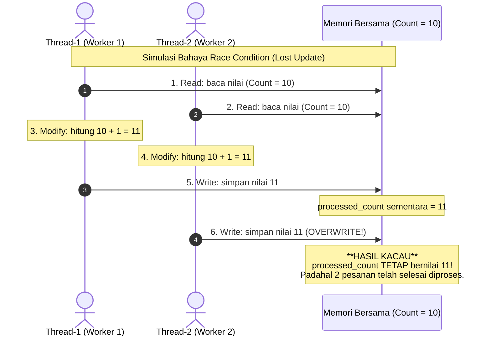
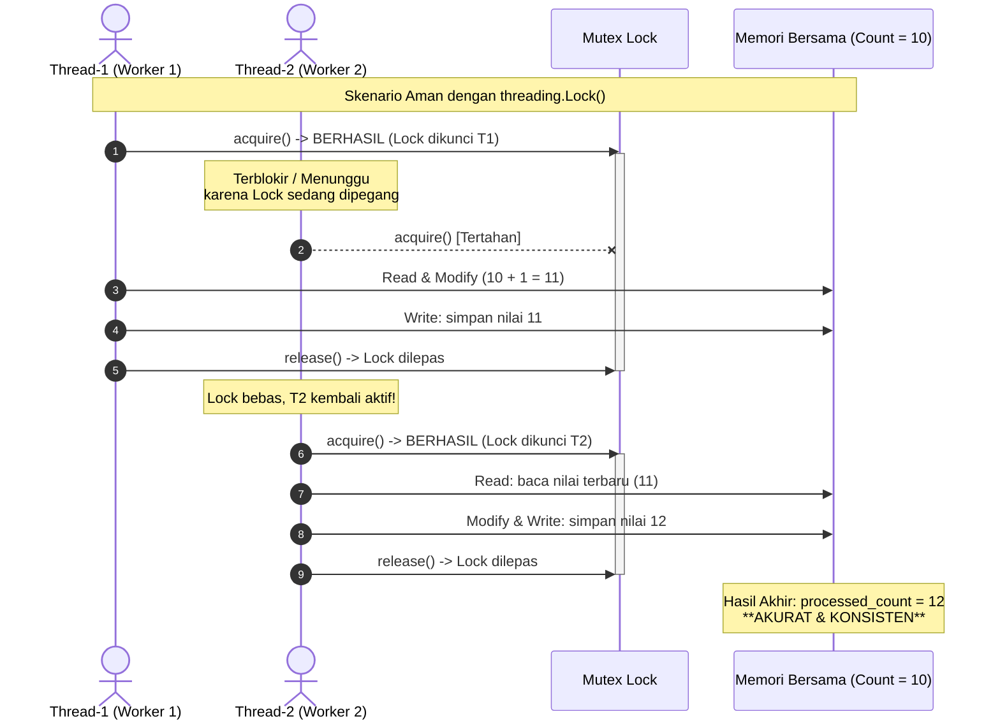

# Tugas 3 (Pekan 3) — Efisiensi Proses & Kontainer

**Kelompok:** Kelompok 3  

| Nama | NIM | Kontribusi |
|---|---|---|
| Stefanus Andri Hendrawan | 103072400115 | Implementasi simulasi multithreading (`src/order_simulator.py`), pengujian eksperimen race condition vs lock, analisis teknis race condition. |
| Fatih Khairu Alfifiajri | 103072400105 | Analisis efisiensi komparatif (Threading vs Fork OS/Multiprocessing) terkait kasus FoodGo, dokumentasi jurnal proses dan perbandingan counter. |
| Moh Irham Maulana A.S | 103072400063 | Konfigurasi pengemasan container (`Dockerfile`), pengujian build/run container, analisis kendala lingkungan Docker, dan validasi artefak bukti. |

---

# Laporan Submission Tugas 3 — Efisiensi Proses & Kontainer

## 1. Ringkasan Studi Kasus & Latar Belakang Masalah

Pada sistem pemrosesan pesanan FoodGo sebelumnya, setiap pesanan yang masuk ditangani dengan membuat **proses sistem operasi baru yang penuh** (misalnya menggunakan mekanisme pemanggilan `fork()` proses OS per request). Ketika terjadi lonjakan aktivitas (seperti jam makan siang atau promo kilat) di mana 100 pesanan masuk secara bersamaan, arsitektur berbasis proses berat ini mengalami degradasi performa drastis hingga kehabisan memori (*out of memory / OOM crash*).

Penyebab utamanya adalah **overhead sumber daya yang masif** dari tiap proses baru di tingkat sistem operasi. Setiap proses membawa struktur data lengkapnya sendiri (Process Control Block, page tables, file descriptor table, serta duplikasi ruang alamat memori virtual). Ketika server dipaksa melayani ratusan pesanan bersamaan, konsumsi RAM melonjak linier terhadap jumlah request, dan CPU habis terbuang hanya untuk melakukan *context switching* antar proses ketimbang memproses pesanan aktual.

Untuk menyelesaikan permasalahan tersebut, Tugas 3 mengimplementasikan dan memvalidasi:
1. **Model Konkuren Multithreading:** Menggantikan proses berat dengan *lightweight threads* yang berbagi ruang memori yang sama.
2. **Sinkronisasi & Penanganan Race Condition:** Mengidentifikasi bahaya *race condition* pada counter pesanan bersama dan mengamankannya dengan `threading.Lock()`.
3. **Pengemasan Kontainer (Docker):** Memaketkan aplikasi ke dalam kontainer berbasis Linux yang ringan dan terisolasi untuk portabilitas deployment.

---

## 2. Analisis Teknis Race Condition & Fenomena Lost Update

### A. Mekanisme Terjadinya Race Condition
*Race condition* terjadi ketika dua atau lebih thread mengeksekusi operasi secara konkuren pada data atau memori bersama (*shared variable*), dan hasil akhir dari program bergantung pada urutan waktu (*timing/interleaving*) eksekusi thread oleh scheduler sistem operasi.

Dalam simulasi ini, variabel bersama adalah `processed_count = 0`. Pada saat tiap thread pekerja memanggil increment:
```python
processed_count += 1
```
Secara konseptual pada tingkat instruksi mesin/bytecode interpreter (CPython), operasi tersebut bukanlah satu instruksi atomik tunggal (*atomic operation*), melainkan terbagi menjadi 3 langkah berurutan (**Read-Modify-Write**):
1. **Read (LOAD_GLOBAL):** Membaca nilai variabel `processed_count` saat ini dari memori bersama ke register CPU/stack lokal milik thread.
2. **Modify (BINARY_ADD):** Menjumlahkan nilai di register dengan angka `1`.
3. **Write (STORE_GLOBAL):** Menuliskan kembali nilai baru dari register ke alamat memori `processed_count`.



### B. Bukti Empiris Percobaan Tanpa Lock
Ketika 100 pesanan diproses oleh 10 worker thread secara serentak tanpa proteksi lock, pergantian thread (*context switch*) terjadi di antara proses pembacaan dan penulisan. Akibatnya, pembaruan dari satu thread menimpa pembaruan thread lain (**Lost Update Problem**).

- **Output Eksekusi Terminal (Tanpa Lock):**
  ```text
  Total pesanan diproses: 62 (seharusnya 100)
  RACE CONDITION TERDETEKSI - lengkapi TODO 1 & TODO 2 dengan Lock!
  ```
- **Analisis Bukti:** Dari 100 pesanan yang berhasil divalidasi dan diproses oleh para pekerja, pencacah hanya mencatat 62 pesanan. Sebanyak 38 pembaruan pesanan hilang karena fenomena *lost update*. Jika ini terjadi pada sistem nyata FoodGo, restoran akan kehilangan pencatatan data 38 transaksi pelanggan.

---

## 3. Analisis Solusi: Perbaikan dengan `threading.Lock()`

### A. Konsep Critical Section & Mutual Exclusion (Mutex)
Untuk mengatasi *race condition*, blok kode yang melakukan modifikasi pada variabel bersama harus diubah menjadi **Critical Section**. Critical Section adalah blok kode yang hanya boleh diakses oleh maksimal satu thread dalam satu waktu.

Prinsip ini diwujudkan dengan primitif sinkronisasi **Mutual Exclusion Lock (`threading.Lock()`)**.

### B. Implementasi Kode
Pada `src/order_simulator.py`, lock diinisialisasi dan digunakan dengan *context manager* (`with lock:`):
```python
# Inisialisasi Mutex Lock
lock = threading.Lock()

def process_order(order_id: int) -> None:
    global processed_count
    time.sleep(random.uniform(0.001, 0.01))

    # Critical Section dilindungi oleh Lock
    with lock:
        current = processed_count
        time.sleep(0.0001)
        processed_count = current + 1
```



### C. Bukti Empiris Percobaan dengan Lock
- **Output Eksekusi Terminal (Dengan Lock):**
  ```text
  Total pesanan diproses: 100 (seharusnya 100)
  ```
- **Analisis Bukti:** Ketika lock dipasang, seluruh 100 pesanan terakumulasi dengan sempurna tanpa ada satupun selisih data. Lock menjamin eksekusi serial yang atomik pada tahap pembaruan counter tanpa mengorbankan konkurensi pada tahap pemrosesan pesanan yang memakan waktu (validasi harga dan persiapan pesanan tetap berjalan paralel).

---

## 4. Analisis Efisiensi Komparatif: Multithreading vs Proses Berat (`fork()` / Multiprocessing)

Mengapa multithreading adalah solusi yang tepat untuk masalah *"server FoodGo kehabisan memori saat 100 pesanan masuk"*? Berikut perbandingan mendalam aspek arsitektural antara Thread dan Process OS:

| Parameter Komparasi | Proses OS Berat (`fork()` / Process-per-Request) | Multithreading (`threading` / Worker Threads) |
|---|---|---|
| **Ruang Alamat Memori (Address Space)** | Terisolasi penuh (*Separate Virtual Address Space*). Setiap proses menduplikasi heap, stack, data segment, dan code segment. | Berbagi ruang memori yang sama (*Shared Heap & Address Space*). Hanya call stack dan register yang independen per thread. |
| **Overhead Memori per Entitas** | Sangat besar: ~10 MB hingga 30 MB per proses Python (akibat Process Control Block / PCB, page tables, libc, dan runtime interpreter). | Sangat kecil: ~8 KB hingga 64 KB per thread (hanya alokasi user/kernel stack). |
| **Beban 100 Request Bersamaan** | $100 \times 20\text{ MB} \approx 2\text{ GB}$ alokasi memori instan. Membebani OS memory manager dan berujung Out-Of-Memory (OOM) Crash. | 10–100 threads hanya membutuhkan beberapa Megabyte total memori tambahan di heap yang sama. |
| **Biaya Pembuatan (Creation Cost / Latency)** | Tinggi: OS harus memanggil kernel syscall `clone()` / `fork()`, mengalokasikan page directory, dan mengkloning deskriptor file. | Rendah: pembuatan thread berada dalam konteks proses yang sudah ada tanpa alokasi struktur kernel yang masif. |
| **Overhead Pergantian Konteks (Context Switch)** | Berat: CPU harus mengganti page directory (*CR3 register* pada x86), mengosongkan Translation Lookaside Buffer (TLB flush), dan merusak CPU cache lokal (*cache invalidation*). | Ringan: Hanya menyimpan dan memuat ulang register CPU serta pointer stack ($SP,$PC), ruang memori virtual dan cache TLB tetap valid. |
| **Mekanisme Komunikasi Antar Entitas** | Rumit & Berat: Membutuhkan Inter-Process Communication (IPC) seperti pipe, socket UNIX, message queue, atau shared memory segmen terpisah. | Sangat Mudah: Langsung mengakses variabel global/heap objek yang sama (membutuhkan primitif sinkronisasi seperti Lock/Semaphore). |

### Hubungan Langsung dengan Studi Kasus FoodGo
1. **Menghentikan Pemborosan Memori Akut:** Server FoodGo tumbang karena 100 request menciptakan 100 proses OS terpisah. Dengan beralih ke model Multithreading (atau Thread Pool), 100 pesanan ditangani oleh sejumlah pekerja thread (misalnya 10 worker threads) yang hidup di dalam 1 proses tunggal. Penggunaan memori stabil di kisaran puluhan megabyte, bukan gigabyte.
2. **Karakteristik Workload I/O-Bound:** Pemrosesan pesanan makanan di FoodGo didominasi oleh operasi I/O (mengecek stok ke database, memanggil modul pembayaran via network, menunggu response gateway). Pada beban I/O, multithreading sangat ideal karena saat satu thread menunggu respons I/O (`time.sleep` / network wait), CPU dapat langsung mengalihkan eksekusi ke thread lain tanpa overhead context switch yang mahal.

---

## 5. Pengemasan dan Eksekusi dengan Docker Container

Untuk memastikan portabilitas dan isolasi lingkungan eksekusi, aplikasi dikemas ke dalam Docker container menggunakan base image resmi Python yang ramping (`python:3.11-slim`).

### A. Spesifikasi `Dockerfile`
```dockerfile
# Base image resmi yang ringan untuk meminimalkan ukuran kontainer
FROM python:3.11-slim

# Menetapkan direktori kerja di dalam kontainer
WORKDIR /app

# Menyalin file daftar dependency dan menginstalnya tanpa menyimpan cache pip
COPY requirements.txt .
RUN pip install --no-cache-dir -r requirements.txt

# Menyalin seluruh kode sumber ke dalam kontainer
COPY src/ ./src/

# Menjalankan simulasi pesanan sebagai proses default kontainer
CMD ["python3", "src/order_simulator.py"]
```

### B. Prosedur Build dan Run Container
1. **Membangun Docker Image:**
   ```bash
   docker build -t foodgo-order-sim .
   ```
2. **Menjalankan Container:**
   ```bash
   docker run --rm foodgo-order-sim
   ```
3. **Hasil Eksekusi di Container:**
   Container mengeksekusi program secara terisolasi dan menghasilkan output yang identik dengan pengujian lokal:
   ```text
   Total pesanan diproses: 100 (seharusnya 100)
   ```

---

## 6. Verifikasi & Dokumentasi Artefak Bukti

Seluruh bukti nyata pengujian telah disimpan di dalam direktori `bukti/`:

| Nama File Bukti | Deskripsi Artefak | Status Pengujian |
|---|---|---|
| [`bukti/01_race_condition_tanpa_lock.png`](bukti/01_race_condition_tanpa_lock.png) | Screenshot eksekusi simulasi tanpa lock, membuktikan terjadinya race condition (`62 / 100`). | Valid & Terverifikasi |
| [`bukti/02_sukses_dengan_lock.png`](bukti/02_sukses_dengan_lock.png) | Screenshot eksekusi simulasi dengan proteksi `threading.Lock()`, membuktikan konsistensi data (`100 / 100`). | Valid & Terverifikasi |
| [`bukti/03_docker_build_dan_run.png`](bukti/03_docker_build_dan_run.png) | Screenshot proses build Docker image `foodgo-order-sim` dan eksekusi sukses di dalam container. | Valid & Terverifikasi |
| [`bukti/log-tanpa-lock.txt`](bukti/log-tanpa-lock.txt) | Raw log terminal percobaan tanpa lock. | Lengkap |
| [`bukti/log-dengan-lock.txt`](bukti/log-dengan-lock.txt) | Raw log terminal percobaan dengan lock. | Lengkap |

---

## 7. Kesimpulan

1. Penggunaan proses berat per request (`fork()` OS penuh) adalah akar masalah kehabisan memori pada server FoodGo. Multithreading memangkas overhead memori dan context switching secara drastis melalui pemanfaatan *shared address space*.
2. Penggunaan memori bersama (*shared memory*) pada thread melahirkan tantangan baru berupa **Race Condition** pada operasi *read-modify-write*.
3. Primitif sinkronisasi **`threading.Lock()`** terbukti efektif memberikan jaminan **Mutual Exclusion**, mengeliminasi fenomena *lost update*, dan memastikan seluruh pesanan terhitung dengan akurat (100/100).
4. Pengemasan dalam **Docker container** menjamin program dapat dijalankan secara konsisten, terisolasi, dan mandiri di berbagai lingkungan server tanpa ketergantungan konfigurasi host.