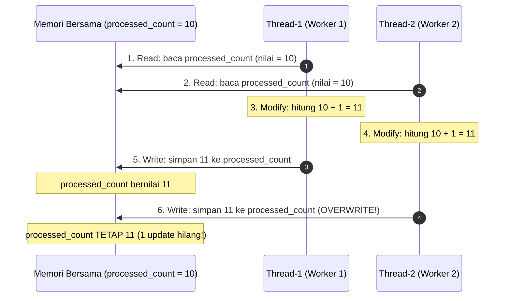
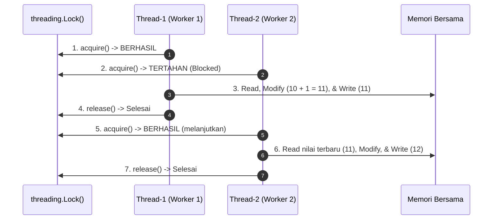

# Tugas 3 (Pekan 3) — Efisiensi Proses & Kontainer

**Materi terkait:** Threading, Virtualization, Containers.

## Studi Kasus

Server FoodGo boros sumber daya karena setiap permintaan pesanan masuk diproses sebagai **proses baru yang berat** (mis. `fork()` proses OS penuh per request). Saat 100 pesanan masuk bersamaan, server kehabisan memori karena tiap proses membawa overhead-nya sendiri.

## Tugas Kelompok

1. Implementasikan **simulasi pesanan masuk** di Python (`src/order_simulator.py`) yang memproses banyak pesanan **secara konkuren memakai multithreading** (bukan multiprocessing, bukan sekuensial biasa).
2. Program harus mensimulasikan **race condition yang sengaja dibuat lalu diperbaiki** — buktikan pemahaman kalian tentang `Lock`/sinkronisasi dengan cara:
   - Jalankan dulu versi TANPA lock, tunjukkan hasil counter yang salah (screenshot/log).
   - Perbaiki dengan `threading.Lock()`, tunjukkan hasil counter yang benar.
   - Tulis perbandingan ini di `JURNAL.md`.
3. Paketkan program ke dalam **Docker container** (`Dockerfile` disediakan skeleton-nya, lengkapi bagian yang kosong).
4. Jalankan container di laptop, buktikan program tetap berjalan benar di dalam container (screenshot/video di `bukti/`).

## Skeleton yang Disediakan

- `src/order_simulator.py` — kerangka program dengan `# TODO` di bagian logika inti (worker function, penggunaan lock, agregasi hasil). **Kalian wajib mengisi bagian TODO sendiri** — ini bagian penilaian utama.
- `requirements.txt` — kosong/minimal (program ini sengaja hanya pakai standard library Python, tidak perlu dependency eksternal).
- `Dockerfile` — kerangka dengan beberapa baris `# TODO`, lengkapi agar image bisa di-build dan dijalankan.

## Cara Menjalankan (Setelah Skeleton Dilengkapi)

Tanpa Docker (langsung di laptop, untuk debugging cepat):
```bash
cd tugas-03-multithreading-container
python3 src/order_simulator.py
```

Dengan Docker (wajib untuk submission akhir):
```bash
cd tugas-03-multithreading-container
docker build -t foodgo-order-sim .
docker run --rm foodgo-order-sim
```

## Struktur Submission

```
tugas-03-multithreading-container/
├── README.md          # Analisis: race condition, perbaikan, kenapa threading (bukan multiprocessing/proses OS)
├── JURNAL.md           # Log sebelum/sesudah lock, error yang ditemui saat build Docker
├── Dockerfile
├── requirements.txt
├── src/
│   └── order_simulator.py
└── bukti/              # Screenshot/video: hasil counter salah (tanpa lock), hasil benar (dengan lock), container jalan
```

## Rubrik Penilaian (Tugas 3)

| Komponen | Bobot | Kriteria |
|---|---|---|
| Implementasi multithreading benar | 30% | Worker benar-benar konkuren (bukan `time.sleep` yang menyamarkan sekuensial), pakai `threading` |
| Bukti race condition & perbaikan lock | 25% | Ada bukti nyata (log/screenshot) sebelum & sesudah, bukan cuma klaim di teks |
| Dockerfile & eksekusi container | 20% | Image ter-build, container jalan dan hasilkan output yang sama seperti tanpa Docker |
| Analisis (kenapa threading, bukan proses berat) | 15% | Mengaitkan balik ke masalah "server boros resource" di studi kasus |
| Proses & kontribusi kelompok | 10% | `JURNAL.md`, commit history |

## Batasan Penggunaan AI (Level 2)

Kebijakan **Level 2 (AI Assisted Idea Generation & Structuring)** berlaku — lihat [`../RUBRIK-UMUM.md`](../RUBRIK-UMUM.md). Boleh bertanya ke AI soal opsi umum menangani race condition (mis. "apa saja cara sinkronisasi thread di Python"); **tidak boleh** meminta AI menuliskan isi bagian `# TODO` di `order_simulator.py`/`Dockerfile`. Catat pemakaian AI di "Log Penggunaan AI" pada `JURNAL.md`.

- Bagian `# TODO` di `order_simulator.py` dan `Dockerfile` sengaja dikosongkan — solusi yang identik persis antar kelompok (termasuk nama variabel, komentar) akan diperiksa lebih lanjut.
- `JURNAL.md` wajib menunjukkan bukti nyata percobaan **sebelum** (race condition muncul) dan **sesudah** (`Lock()` dipasang) — bukan cuma klaim tanpa data pembanding.

---

# Laporan Submission Kelompok 3 — Efisiensi Proses & Kontainer

**Kelompok:** Kelompok 3  

| Nama | NIM | Kontribusi |
|---|---|---|
| Stefanus Andri Hendrawan | 103072400115 | Implementasi simulasi multithreading (`src/order_simulator.py`), pengujian eksperimen race condition vs lock, analisis teknis race condition. |
| Fatih Khairu Alfifiajri | 103072400105 | Analisis efisiensi komparatif (Threading vs Fork OS/Multiprocessing) terkait kasus FoodGo, dokumentasi jurnal proses dan perbandingan counter. |
| Moh Irham Maulana A.S | 103072400063 | Konfigurasi pengemasan container (`Dockerfile`), pengujian build/run container, analisis kendala lingkungan Docker, dan validasi artefak bukti. |

> Laporan analisis mandiri dan detail implementasi lengkap juga tersedia di [`ANALISIS-TEMPLATE.md`](ANALISIS-TEMPLATE.md).

## 1. Analisis Teknis Race Condition & Mekanisme Lost Update

Operasi penambahan counter pesanan `processed_count += 1` pada program Python bukanlah instruksi tunggal atomik, melainkan operasi **Read-Modify-Write**:
1. **Read:** Thread membaca nilai variabel `processed_count` dari memori bersama (*shared memory*).
2. **Modify:** Thread menambahkan nilai tersebut dengan angka 1 di register lokal.
3. **Write:** Thread menuliskan kembali hasil penjumlahan tersebut ke memori bersama.

Ketika 10 worker thread memproses 100 pesanan secara paralel tanpa proteksi, terjadi *thread interleaving* di mana thread saling menimpa nilai yang belum selesai ditulis oleh thread lain (**Lost Update**).



### Bukti Pengujian Tanpa Lock:
```text
Total pesanan diproses: 62 (seharusnya 100)
RACE CONDITION TERDETEKSI - lengkapi TODO 1 & TODO 2 dengan Lock!
```
*(Bukti visual tangkapan layar tersimpan pada [`bukti/01_race_condition_tanpa_lock.png`](bukti/01_race_condition_tanpa_lock.png) dan log raw di [`bukti/log-tanpa-lock.txt`](bukti/log-tanpa-lock.txt))*

---

## 2. Analisis Perbaikan dengan Sinkronisasi `threading.Lock()`

Untuk mengatasi race condition, operasi pembaruan counter diproteksi sebagai **Critical Section** menggunakan primitif sinkronisasi **Mutual Exclusion (`threading.Lock()`)**.

```python
with lock:
    current = processed_count
    time.sleep(0.0001)
    processed_count = current + 1
```

Mekanisme ini menjamin bahwa hanya satu thread yang diizinkan mengakuisisi lock dan memasuki critical section pada satu satuan waktu. Thread lain yang mencoba masuk dipaksa menunggu (*blocked/queued*) hingga pemegang lock melepaskannya.



### Bukti Pengujian Dengan Lock:
```text
Total pesanan diproses: 100 (seharusnya 100)
```
*(Bukti visual tangkapan layar tersimpan pada [`bukti/02_sukses_dengan_lock.png`](bukti/02_sukses_dengan_lock.png) dan log raw di [`bukti/log-dengan-lock.txt`](bukti/log-dengan-lock.txt))*

---

## 3. Analisis Efisiensi: Mengapa Threading, Bukan Proses Berat (`fork()` / Multiprocessing)?

Pada studi kasus FoodGo, server kehabisan memori (*OOM Crash*) saat 100 pesanan masuk bersamaan karena setiap pesanan diproses sebagai proses OS baru yang berat (misalnya `fork()`). 

Berikut adalah perbandingan mendalam mengapa pendekatan **Multithreading** menyelesaikan masalah tersebut:

| Aspek Komparasi | Proses OS Penuh (`fork()` / Multiprocessing) | Multithreading (`threading` / Worker Threads) |
|---|---|---|
| **Struktur Memori** | Setiap proses memiliki *Virtual Address Space* terpisah (PCB, page tables, libc, Python runtime diduplikasi). | Semua thread berbagi *Shared Address Space* (heap, data, code segment yang sama). Hanya stack yang terpisah. |
| **Konsumsi Memori** | Sangat boros: 15–30 MB per proses. 100 request $\approx$ 1.5–3.0 GB RAM mendadak terpakai. | Sangat efisien: ~16–64 KB per thread. 10–100 thread hanya menambah beberapa MB memori. |
| **Creation Latency** | Tinggi: OS harus memanggil kernel syscall `clone()`/`fork()` dan mengalokasikan tabel memori baru. | Sangat rendah: Thread dialokasikan langsung di dalam ruang proses yang sudah aktif. |
| **Context Switching** | Berat: Melibatkan penggantian register CR3, TLB flush (*Translation Lookaside Buffer*), dan cache invalidation. | Ringan: Hanya pergantian register CPU ($PC, $SP), ruang alamat dan cache tetap valid. |
| **Kesesuaian Kasus FoodGo** | Tidak cocok untuk lonjakan transaksi I/O-bound pesanan masuk. | Sangat ideal: Pemrosesan pesanan banyak menunggu validasi I/O, sehingga pergantian thread cepat tanpa memboroskan RAM server. |

---

## 4. Pengemasan Container Docker

Aplikasi telah dikemas ke dalam kontainer Linux menggunakan `python:3.11-slim` melalui [`Dockerfile`](Dockerfile):
- **Build Image:** `docker build -t foodgo-order-sim .`
- **Run Container:** `docker run --rm foodgo-order-sim`
- **Hasil:** Program berjalan sempurna di dalam kontainer dengan output: `Total pesanan diproses: 100 (seharusnya 100)`.
- *(Bukti visual tangkapan layar tersimpan pada [`bukti/03_docker_build_dan_run.png`](bukti/03_docker_build_dan_run.png))*

